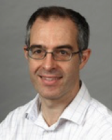

 
 

# MSc Cognitive Neuroscience

##### Denis Schluppeck, 2021-12-08
---

# Welcome!

---
## Mission statement
> The MSc in *Cognitive Neuroscience* is an exciting research-led programme that provides an in-depth grounding in **brain imaging techniques** and **neuroscience research**. Teaching is delivered through a combination of lectures, practical classes, workshops and **hands-on** projects.

---
## People

- Dr Denis Schluppeck (Course director, Tutor)
Room C63
denis.schluppeck@nottingham.ac.uk
(0115) 84 68580

- Dr Matias Ison (Tutor)
Room C46
matias.Ison@nottingham.ac.uk
(0115) 95 15277

---
## People++

               
Schürmann – Serrien – Ison – Danielmeier – Derrfuss – Bauer  – Filik

`+` **lectures from many other contributors**, including Lucy Cragg, Steve Jackson, Chris Madan, Riika Mottonen, Andrew Reid, Walter van Heuven

https://www.nottingham.ac.uk/psychology/research

---

## Course Structure / ``core modules``

170 credits, 10 optional

## Autumn term

- **PSGY4020**	Functional Imaging Methods,	20		
- **PSGY4009**	Experimental Design for Functional Imaging,	10		
- **PSGY4014**	Introduction to Matlab,	10		

- **PSGY4005**	Professional skills (full Year),	10+10	

---

## Spring, Summer

- **PSGY4013**	Analytical Research Methods,		10	
- **PSGY4043**	Data Analysis for Neuroimaging,		10	
- **opt**	Seminars Cog Neurosci / Clinical Neuropsych,		(10)	
- **PSGY4011**	Research Placement,		 30	
- **PSGY4012**	Research Project,	60

---

## we go and scan together

2019 - SPMIC - Week 2, *Data Analysis for Neuroiamging*

---

## What about those optional modules?

For the Spring term, you'll need to pick **one of**:

- **PSGY4008** Current Issues in Cognitive Neuroscience, 10  (Derrfuss)
- **PSGY4022** Clinical Neuropsychology, 10   (Danielmeier)

---

## Timetable (2019)

---

## Helpful info (web / cloud)

- Mailing list for the group

- Neuroimaging Group (papers / discussions): usually fortnightly meetings, TBC Claudia.Danielmeier@nottingham.ac.uk

- Sir Peter Mansfield Imaging Centre (SPMIC) seminars www.nottingham.ac.uk/research/groups/spmic/events.aspx

- **Facebook page**: last year we had https://www.facebook.com/groups/MScBrainImaging2018 - will invite you all to the 2019 group

---

## Helpful info (people)

worries about the course, stuff in general? Come and talk to us after class / stop by my office / e-mail me to find some time for a chat / ...

+ *Academics*  &ensp; :arrow_right: &ensp;  Denis, Matias, any other member of staff
+ *Admin*  &ensp; :arrow_right: &ensp; School Office  &ensp; PGT team

---

# OK, so what do I need to do now?

---

# Prospectus page

---

# First teaching 

... first the engagements are

- `Experimental Design for Functional Imaging`  **Tuesday, 9-11am  – George Green A3** and

- ``Introduction to Matlab / Programming`` :boom: :heart: :computer:  	**Tuesday, 4-6pm  – A5**

---

# Food + chance to socialize :fries:, :green_apple:, :bread:, ...

- lunch with fellow grad students, Psychology staff in **Social Space** now (12noon)

- people usually heading to the the pub ~5pm (Johnson Arms)
