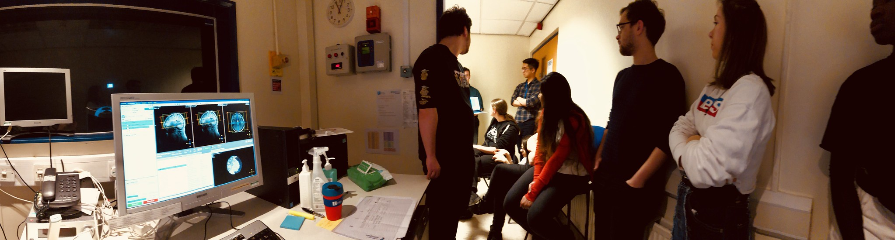

# MSc Cognitive Neuroscience Handbook

Denis Schluppeck, 2022-07-05

## Mission statement

> The MSc in *Cognitive Neuroscience* is an exciting research-led programme that provides an in-depth grounding in **brain imaging techniques** and **neuroscience research**. Teaching is delivered through a combination of lectures, practical classes, workshops and **hands-on** projects.

## People

| Name                | Role                   |                                                                                                                                          | Contact                                           |
|---------------------|------------------------|------------------------------------------------------------------------------------------------------------------------------------------|---------------------------------------------------|
| Dr Denis Schluppeck | Course director, Tutor   Convenor PSGY4009 (Exp Design) |  | [email](mailto:denis.schluppeck@nottingham.ac.uk) |
| Dr Matias Ison      | Tutor                  |            | [email](mailto:matias.Ison@nottingham.ac.uk)      |
| Dr Martin Schuermann | Convenor PSGY4040 (Methods)  Convenor PSGY4014 (Matlab)|  | [email](mailto:martin.schuermann@nottingham.ac.uk)   |
| Dr Domenica Veniero | Convenor PSGY4005 (Professional Skills)|  | [email](mailto:Domenica.Veniero@nottingham.ac.uk)   |
| Dr Markus Bauer | Convenor PSGY4013 (Analytical Methods)|  | [email](mailto:markus.bauer@nottingham.ac.uk)   |
| Dr Jeyoung Jung | Convenor PSGY4043 (DAfNI)|  | [email](mailto:jeyoungjung@nottingham.ac.uk)   |
| Dr Claudia Danielmeier | Convenor PSGY4022 (Clinical)|  | [email](mailto:claudiadanielmeier@nottingham.ac.uk)   |
| Dr Jan Derrfuss | Convenor PSGY4008 (Cognitive)|  | [email](mailto:jan.derrfuss@nottingham.ac.uk)   |
| Dr Deborah Serrien | Convenor PSGY4011 (Placement)   PSGY4012 (Research project)|  | [email](mailto:deborah.serrien@nottingham.ac.uk)   |

## Links

- Overview of the course in <a href="2021-12-08-virtualOpenDay/2021-12-08-virtualOpenDay-ds.html" target="new">2021 Virtual Open Day slides</a>
([markdown](2021-12-08-virtualOpenDay/2021-12-08-virtualOpenDay-ds.md))

- [MSc Cognitive Neuroscience Prospectus](https://www.nottingham.ac.uk/pgstudy/course/taught/cognitive-neuroscience-msc)
